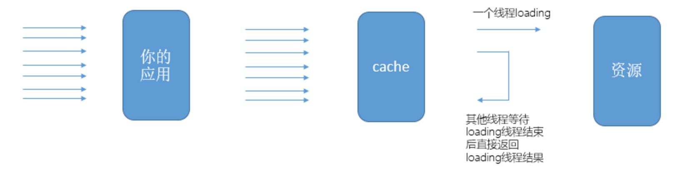

一般我们获取缓存值得姿势是这样的：
```
Object result = cache.get(CACHE_KEY);
if(result == null){
    //重新获取缓存
    result = xxxx(xxx);
    cache.put(CACHE_KEY,CACHE_TTL,result); 
}
return result;
```
> 高并发下暴露问题
你的程序一直正常运行，直到某一日，运营的同事急匆匆的跑来找到你，你的程序挂了，可能是XXX在大量抓你的数据。我们重启了应用也没用，没几秒程序又挂了。

机智的你通过简单的排查，得出数据库顶不住访问压力，顺利的将锅甩走。 不过仔细一想，我们不是有缓存吗，怎么缓存没起作用？ 查看下缓存，一切正常，也没发现什么问题啊？

进过各种debug、查日志、测试环境模拟，花了整整一下午，你终于找到罪魁祸首，原因很简单，正是我们没有使用正确的姿势使用缓存~~~

> 问题分析

这里我们排除熔断、限流等外部措施，单纯讨论缓存问题。

假设你的应用需要访问某个资源（数据库/服务），其能支撑的最大QPS为100。为了提高应用QPS，我们加入缓存，并将缓存过期时间设置为X秒。此时，有个200并发的请求访问我们系统中某一路径，这些请求对应的都是同一个缓存KEY，但是这个键已经过期了。此时，则会瞬间产生200个线程访问下游资源，下游资源便有可能瞬间就奔溃了~~~

>guava是一个google发布的一个开源java工具库，其中guava cacha提供了一个轻量级的本地缓存实现机制，通过guava cache，我们可以轻松实现本地缓存。其中，guava cacha对缓存不存在或者过期情况下，获取缓存值得过程称之为Loading。

不过，这样虽然只有一个线程去执行loading动作，但是其他线程会等待loading线程接受后才能一同返回接口。此时，guava cache通过刷新策略，直接返回旧的缓存值，并生成一个线程去处理loading，处理完成后更新缓存值和过期时间。guava 称之为异步模式。

